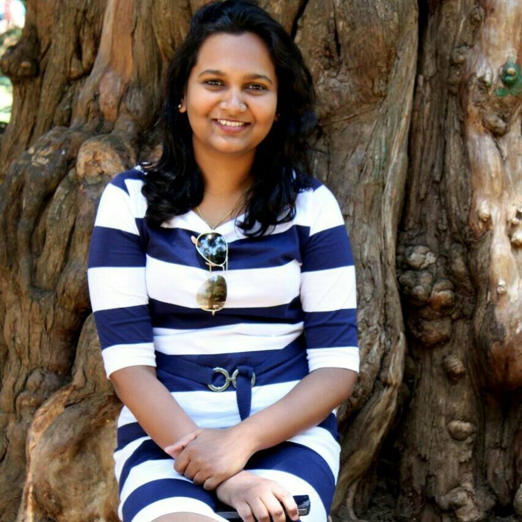

<!-- This won't be displayed but it will initialize your R session. Add any R libraries you need here. -->
```{r init,include=FALSE,echo=FALSE}
library(magrittr)
```


# Welcome! {-}

The site showcases a couple of ideas/problems from Rutika Banakar, a student of MIDS program at School of Information, UC Berkeley. And proposed solutions to these problems which utilizes the power of data science.

```{r hello, echo=FALSE, fig.cap='Rutika Banakar pitch', fig.align='center'}
knitr::include_url('https://drive.google.com/a/berkeley.edu/file/d/1799B0_2IMt7Xsgz-4vTfAUjOjDRyIuzx/view?usp=sharing')
```

<p>

### Smart auto-matcher

Over-the-top content (OTT) is the term used in the broadcasting and technology business reporting to refer to audio, video, and other media transmitted via the Internet as a standalone product, that is, without a cable operator or direct-broadcast satellite television systems controlling or distributing the content. On a daily basis my company receives catalogs of the TV programs from various OTT providers that must be matched to the programs in the company's database. The data my company maintains is an industry standard and the matched content is sold back to the customers who rely on it to power their applications. We can leverage the power of data science and machine learning to auto match the incoming data with our database and hence reduce time and oney spent on hand-matching these records.

### Tool to help reduce carbon footprints

The devastation from hurricanes Harvey, Irma, and Maria and the dozens of wildfires that raged across West U.S. in 2017 have resulted in one of the costliest string of weather events in U.S. history. According to early estimates, over the course of few weeks, the hurricanes and wildfires have left a trail of damage that could add up to nearly $300 billion. The evidence of climate change is undeniable and offsetting your CO2 emissions is a practical and immediate way to take ownership of your personal contribution to climate change. I wish to build a tool for every environmentally cautious person to help them monitor their carbon footprint and reduce it. Small changes from everyone can add up to great benefits.

## About the author {-}

```{r hello-world,echo=FALSE,fig.cap='Rutika Banakar',fig.align='center',out.width='50%'}

```

Rutika graduated with a Bachelors degree in Computer Science and Engineering from Vishweshwaraya Technological University, India in 2011 and currently works as a Software Engineer at Gracenote, a Nielsen company in Emeryville, CA. When not working she loves to bake and hike around the many awesome trails in bay area.

*Updated: `r Sys.Date()`*
